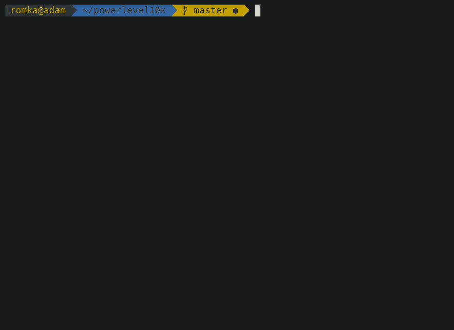

# How I Have Set Up My Terminal: Guide to ZSH Setup

Want to have better terminal experience? Here's my setup combining iTerm2, ZSH, Oh My Zsh, and powerful plugins that'll make your command-line work both beautiful and efficient.



## The Stack

- **iTerm2**: macOS terminal replacement
- **ZSH**: shell with enhanced features
- **Oh My Zsh**: framework for managing ZSH configuration
- **Powerlevel10k**: feature-rich theme

## Why This Setup?

ZSH comes pre-installed on modern macOS (Catalina and later), offering superior features over bash. When combined with Oh My Zsh and carefully selected plugins, it provides:

- Smarter autocompletion
- Syntax highlighting
- Better history management
- Enhanced pattern matching
- Git integration
- Python development tools

## Essential Plugins

- `zsh-autosuggestions`: Context-aware command suggestions
- `zsh-syntax-highlighting`: Real-time command validation
- `python`, `pip`, `pyenv`, `virtualenv`: Python development tools
- `web-search`: Quick web searches from terminal

## Installation Guide

### For macOS

```bash
# Install Homebrew (if needed)
/bin/bash -c "$(curl -fsSL https://raw.githubusercontent.com/Homebrew/install/master/install.sh)"

# Install required packages
brew update
brew install zsh

# Install Oh My Zsh
sh -c "$(curl -fsSL https://raw.github.com/ohmyzsh/ohmyzsh/master/tools/install.sh)"

# Install plugins
git clone https://github.com/zsh-users/zsh-autosuggestions ${ZSH_CUSTOM:-$HOME/.oh-my-zsh/custom}/plugins/zsh-autosuggestions
git clone https://github.com/zsh-users/zsh-syntax-highlighting.git ${ZSH_CUSTOM:-$HOME/.oh-my-zsh/custom}/plugins/zsh-syntax-highlighting
git clone --depth=1 https://github.com/romkatv/powerlevel10k.git ${ZSH_CUSTOM:-$HOME/.oh-my-zsh/custom}/themes/powerlevel10k

# Update .zshrc configuration
sed -i '' 's/^ZSH_THEME=.*/ZSH_THEME="powerlevel10k\/powerlevel10k"/' "$HOME/.zshrc"
sed -i "" 's/\(^plugins=([^)]*\)/\1 python pip pyenv virtualenv web-search zsh-autosuggestions zsh-syntax-highlighting/' "$HOME/.zshrc"
```

### For Ubuntu

```bash
# Install requirements
sudo apt-get update
sudo apt-get install -y zsh git

# Install Oh My Zsh and plugins (same as macOS)
sh -c "$(curl -fsSL https://raw.github.com/ohmyzsh/ohmyzsh/master/tools/install.sh)"

git clone https://github.com/zsh-users/zsh-autosuggestions ${ZSH_CUSTOM:-$HOME/.oh-my-zsh/custom}/plugins/zsh-autosuggestions
git clone https://github.com/zsh-users/zsh-syntax-highlighting.git ${ZSH_CUSTOM:-$HOME/.oh-my-zsh/custom}/plugins/zsh-syntax-highlighting
git clone --depth=1 https://github.com/romkatv/powerlevel10k.git ${ZSH_CUSTOM:-$HOME/.oh-my-zsh/custom}/themes/powerlevel10k

# Update .zshrc configuration
sed -i 's/^ZSH_THEME=.*/ZSH_THEME="powerlevel10k\/powerlevel10k"/' "$HOME/.zshrc"
sed -i 's/\(^plugins=([^)]*\)/\1 python pip pyenv virtualenv web-search zsh-autosuggestions zsh-syntax-highlighting/' "$HOME/.zshrc"
```

## Finishing Up

After installation, either restart your terminal or run:

```bash
source ~/.zshrc
```

The Powerlevel10k configuration wizard will automatically start on first launch. Follow the prompts to customize your terminal's appearance.

---

**Pro Tip**: Install [iTerm2](https://iterm2.com/) first on macOS for the best experience. It offers split panes, better color support, and improved window management over the default Terminal.app.